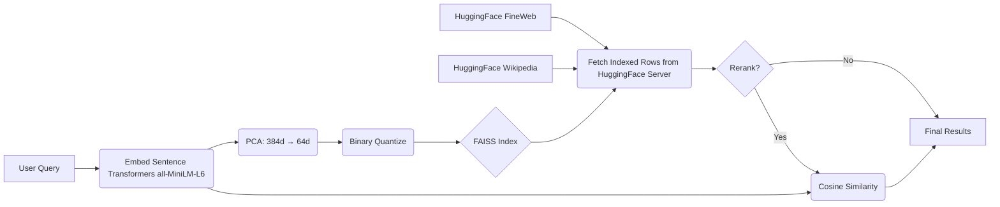

# llmsearchindex

**LLMSearchIndex** is a Python library for internet-scale retrieval in LLM RAG applications using a fully local search index.

We trained a search index on **203,169,792 web pages** sourced from:
- [Wikipedia dataset](https://huggingface.co/datasets/wikimedia/wikipedia)
- [FineWeb dataset](https://huggingface.co/datasets/HuggingFaceFW/fineweb)

This index can be used as external context to significantly improve LLM responses without requiring external API calls at query time.


## Installation

```bash
pip install llmsearchindex
```
PyPI: [https://pypi.org/project/llmsearchindex/](https://pypi.org/project/llmsearchindex/)

Model: https://huggingface.co/zakerytclarke/llmindex

Github: https://github.com/zakerytclarke/llmsearchindex


## Example Usage:
```
from llmsearchindex import LLMIndex

# Initializes and downloads index
index = LLMIndex()

# Standard search (Fastest)
results = index.search("who invented sliced bread", top_k=5)

# High-precision search (Reranked)
results = index.search("who invented sliced bread", top_k=5, rerank=True)

for result in results:
  print(result.get('text'))
  print(result.get('url'))
  print("==="*100)
```


## System requirements
- ~6 GB RAM 
- ~10 GB disk space
- CPU inference supported (GPU optional)


## Architecture 


## Resources
Embeddings: https://huggingface.co/sentence-transformers/all-MiniLM-L6-v2

FAISS Vector search: https://github.com/facebookresearch/faiss

Wikipedia: https://huggingface.co/datasets/wikimedia/wikipedia

FineWeb: https://huggingface.co/datasets/HuggingFaceFW/fineweb


## License- MIT License
